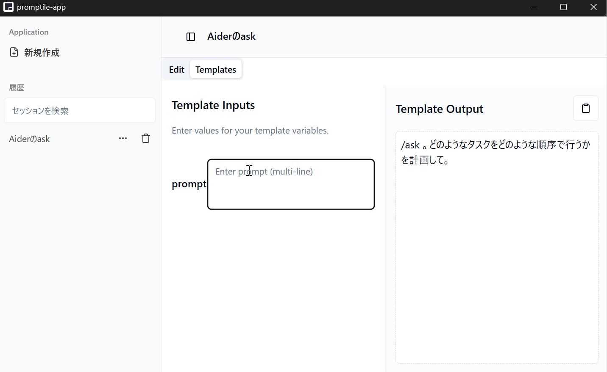

# Promptile

<br />

## About
PromtileはLLMに入力するプロンプトをテンプレートとして保存し再利用できるようにする、クロスプラットフォームGUIアプリケーションです。
- Mustacheベースのテンプレート機能
- 型の設定機能と型に基づくテンプレート適用機能
- Windows/Linux/Mac(Experimental)のクロスプラットフォーム

## Install
### Prerequirements
各プラットフォームでビルドを行います。ビルドにはGolangの開発環境と`wails`コマンドの事前インストールが必要です。
[wailsのインストールガイド](https://wails.io/docs/gettingstarted/installation)にしたがって`wails`の最新バージョンをインストールしてください。
### Install Promtile
プロジェクトのルートで以下のコマンドを実行してください。
```sh
wails build
```
ビルド後`./build/bin`ディレクトリにバイナリが生成されます。

クロスプラットフォームでビルドする場合はプラットフォームを設定してください。
```sh
wails build --platform windows
```

## Screenshot
